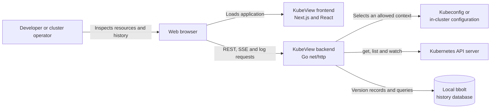
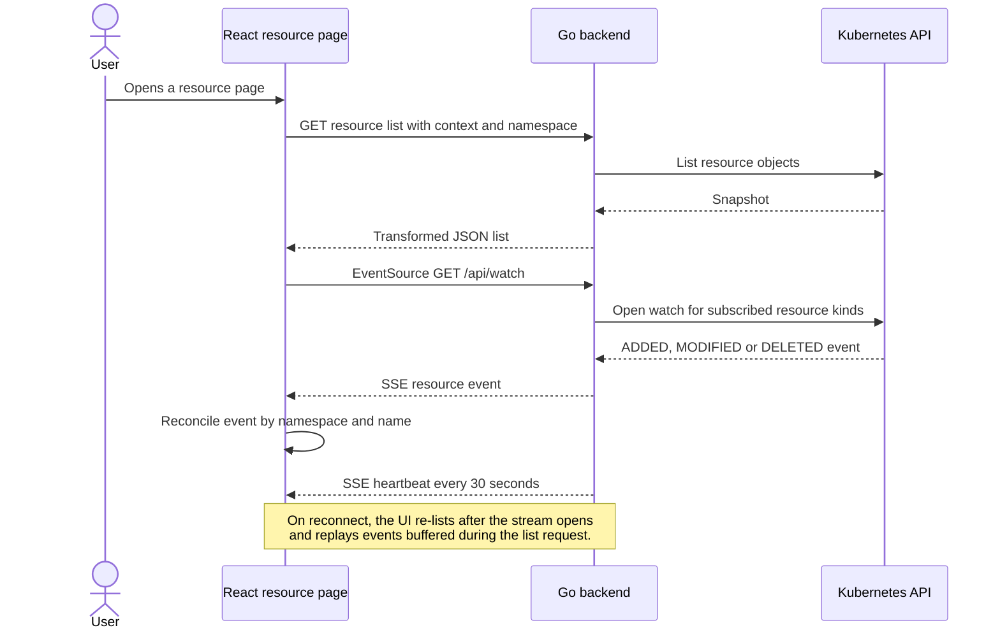
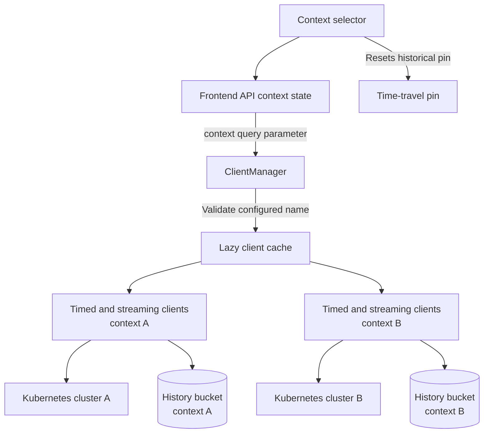
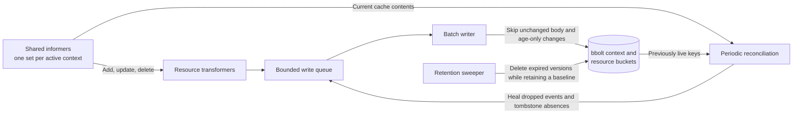
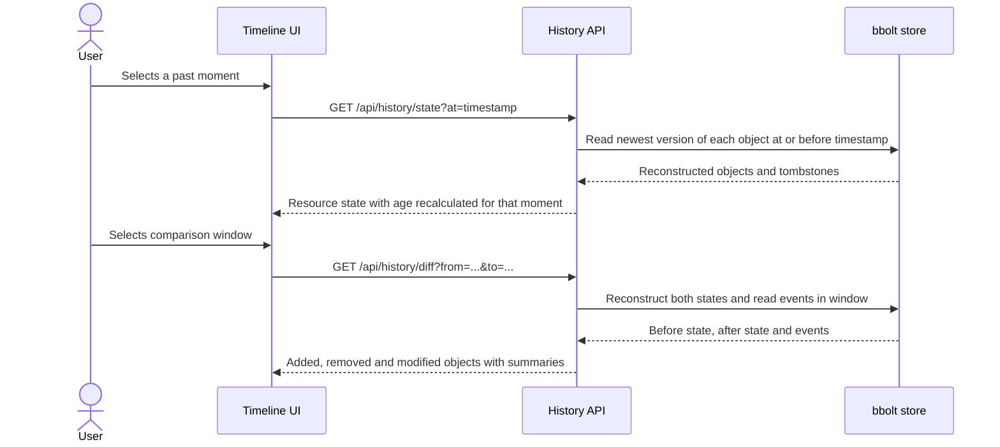
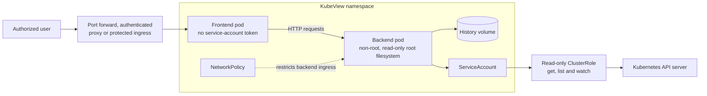

# KubeView architecture diagrams

Evidence baseline: source commit `8ee601c`.

These diagrams are original documentation derived from the source. Mermaid is the editable source. Export each diagram to SVG or PNG only after the official report and presentation templates arrive.

## System context

The browser calls the backend directly. The frontend does not receive a Kubernetes service-account token and does not communicate with the Kubernetes API. The backend is therefore the main trust boundary.

## Live resource update flow

The frontend multiplexes resource subscriptions into one `EventSource` per namespace filter. This avoids exhausting the small per-origin connection limit used by some browsers. A replacement or failed stream triggers a list refresh after reconnection so the table converges even if events were missed.

## Multi-context isolation

`ClientManager` accepts only context names loaded from kubeconfig. It creates clients lazily and caches each context separately. Every list, watch, log, and history request resolves the context before running its handler. The history store uses a top-level bucket per context. The frontend clears a pinned historical timestamp when the selected context changes, preventing a timestamp chosen for one cluster from being reused against another.

## Flight-recorder write and recovery path

The default context starts recording during backend startup. Other contexts start on first use. Informer callbacks never block on storage. If the bounded queue is full, a record can be dropped, but reconciliation later compares informer caches with stored live objects and repairs the gap. The writer stores changed versions and deletion tombstones. Version keys combine the object key with a fixed-width timestamp, which supports state reconstruction at a requested moment. Retention defaults to 72 hours.

## Historical read path

The state endpoint returns the last recorded version at or before the selected time and applies deletion tombstones. The diff endpoint compares two reconstructed maps and includes Kubernetes events from the selected interval. Volatile display fields such as age do not create false changes.

## In-cluster deployment and trust boundaries

The manifests run both containers as non-root users, drop Linux capabilities, and use read-only root filesystems. The frontend does not mount a service-account token. The backend service account can read only the resource types shown by the application, including pod logs and Secrets. The backend has no user authentication, so the deployment still needs a protected access path. NetworkPolicy limits ordinary pod-network ingress to the frontend but does not authenticate the person using the application.

## Design decisions and limits

| Decision | Reason | Cost or limit |
| --- | --- | --- |
| REST snapshot followed by SSE | A list gives a complete initial state; watch events avoid repeated full-list polling. | Reconnection requires a fresh list to cover missed events. |
| One `EventSource` per namespace | Keeps browser connection use bounded while several pages subscribe to resources. | Changing the subscribed set reopens the stream. |
| Separate timed and streaming Kubernetes clients | A 55-second timeout bounds list and detail requests without terminating watches or followed logs. | Each context holds two clientsets after first use. |
| Lazy per-context client cache | Unused kubeconfig contexts do not create clients. | A context can be configured but unreachable until its first request. |
| Local bbolt history | Adds historical reconstruction without an external database. | One writable backend instance owns the file; horizontal replication is unsupported. |
| Bounded, non-blocking recorder queue | Kubernetes informer handlers do not wait for disk writes. | Bursts can drop records until reconciliation repairs current state. |
| Read-only Kubernetes RBAC | The application cannot create, update, or delete workloads. | Read access to logs and Secret values still carries confidentiality risk. |
| Best-effort history startup | A history-path failure does not take down live inspection. | Operators must notice logs or the disabled history response. |

