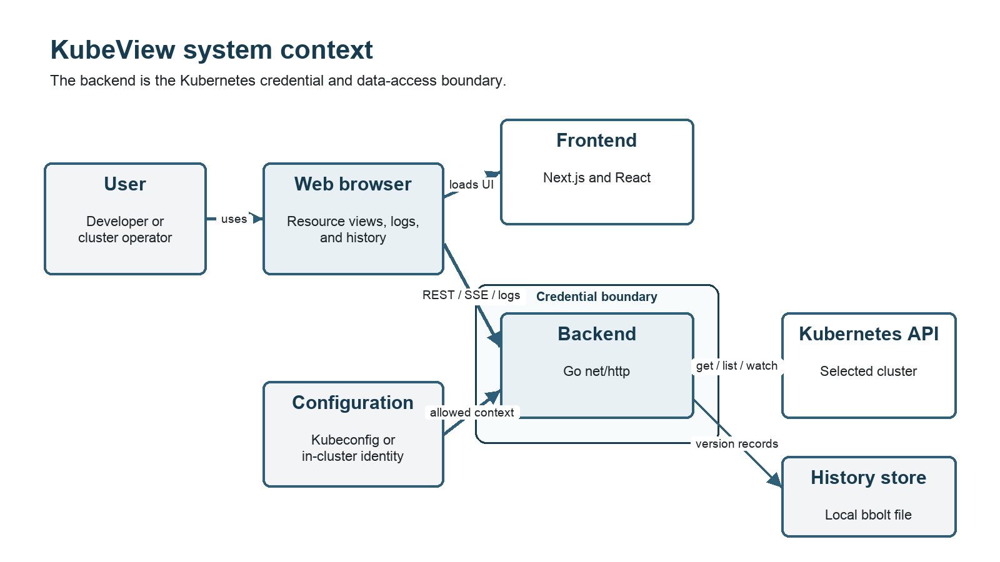

# KubeView

Final project report submitted in partial fulfilment of the requirements for **BSc Computer Science (Online Mode)** at **Birla Institute of Technology and Science, Pilani**

Student: **Ankur Kalita**  
BITS ID: **2023EBCS782**  
Student: **Pradyut Fogla**  
BITS ID: **2023EBCS788**  
Student: **Varun Deep Saini**  
BITS ID: **2023EBCS663**  
Supervisor: `[PLACEHOLDER: supervisor name, designation and organization]`  
Semester: `[PLACEHOLDER: semester and academic year]`  
Submission date: `[PLACEHOLDER: submission date]`

Report status: supervisor-review Markdown draft based on source commit `8ee601c`  
Citation style: **IEEE**

## Supervisor certificate

`[PLACEHOLDER: insert the institution-approved certificate text]`

Supervisor signature: `[PLACEHOLDER: wet or approved digital signature]`  
Date: `[PLACEHOLDER: signature date]`

## Student declaration

We hereby declare that this capstone project titled "KubeView" is an original work carried out by us and has not been submitted to any other university or institution for the award of any degree.

This wording comes from the supplied capstone report format. The supervisor or institution may replace it if a separate prescribed declaration is required.

The contribution and assistance statement must classify every repository contributor and disclose AI assistance according to institutional policy. The working evidence appears in `submission/inventories/CONTRIBUTION_SUMMARY.md` and `submission/drafts/COMPLIANCE_AND_ATTRIBUTION.md`.

## Originality and compliance status

An internal provenance audit was run on 28 August 2026 against source commit `8ee601c` and the current report draft. This is a preparation check, not an institution-approved plagiarism certificate.

| Internal check | Recorded result |
| --- | --- |
| Frozen source scope | 127 Git-tracked files |
| Git history | 27 commits and six recorded author identities or aliases |
| Dependency inventory | 591 Go and npm package installation rows |
| Attribution-marker scan | No embedded copyright, generated-code, or copied/adapted-source marker found outside dependency metadata |
| Exact long-paragraph comparison | One repeated paragraph, the stated UVP shared by this report and the project summary |
| Numbered references in this report | 17 |
| Top-level project licence | Absent at the frozen commit |

The scan cannot establish originality against publications, websites, private repositories, or institutional databases. The five unused SVG starter assets under `kubeview-frontend/public/` must be removed before release or attributed if retained. Contributor roles and project distribution terms also remain open.

| Required external result | Value for supervisor review |
| --- | --- |
| Institution-approved document similarity tool | `[PLACEHOLDER: tool and version]` |
| Document similarity result | `[PLACEHOLDER: percentage, date and report filename]` |
| Institution-approved code compliance method | `[PLACEHOLDER: tool, process or declaration]` |
| Code similarity or compliance result | `[PLACEHOLDER: result, date and report filename]` |
| Explanation of legitimate matches | `[PLACEHOLDER: supervisor-reviewed explanation]` |
| Supervisor acceptance | `[PLACEHOLDER: accepted, revisions required, or rejected]` |

The complete internal audit is retained in `submission/compliance/INTERNAL_ORIGINALITY_AUDIT.md`. Do not estimate or invent an external similarity percentage.

## Acknowledgements

`[PLACEHOLDER: acknowledgements approved by the student and supervisor]`

## Abstract

Kubernetes exposes workload and infrastructure state through an API and command-line tools. A diagnosis often requires several commands for resource lists, object detail, events, logs, and context switching. The commands show current state well, but a short-lived failure can disappear before a user records it. Full monitoring platforms retain operational data, although their deployment and maintenance can exceed the needs of a local cluster, teaching environment, or focused inspection session.

KubeView is a read-only web application for this narrower need. A Next.js frontend displays Kubernetes resources, while a Go backend uses the official Kubernetes client libraries to list objects, watch changes, and stream pod logs. The application supports multiple kubeconfig contexts. A local bbolt flight recorder retains versioned resource state for 72 hours by default and reconstructs cluster state at a selected time. Users can compare two moments and relate object changes to Kubernetes events.

The implementation separates bounded requests from long-running streams, validates requested contexts, and isolates history by context. Kubernetes watch events reach the browser through Server-Sent Events. The frontend combines an initial list with later events and refreshes after reconnection to recover missed changes. The in-cluster deployment uses read-only RBAC, non-root containers, read-only root filesystems, and a NetworkPolicy. KubeView has no user authentication, so operators must place it behind a protected access path.

Validation for commit `8ee601c` includes 227 Go test functions, 60 Vitest cases, and 45 Playwright cases. A retained GitHub Actions run completed six jobs covering backend tests, static analysis, frontend checks and build, CodeQL, and end-to-end tests against a real `kind` cluster. Accessibility, performance, clean-installation evidence, and a retained coverage percentage remain open. KubeView supports live and recent historical diagnosis but does not replace metrics, alerting, tracing, long-term log storage, or production access control.

Keywords: Kubernetes, cluster inspection, Server-Sent Events, client-go, bbolt, time travel, Next.js, Go

## Abbreviations

| Term | Meaning |
| --- | --- |
| API | Application Programming Interface |
| CI | Continuous Integration |
| CORS | Cross-Origin Resource Sharing |
| E2E | End-to-end |
| JSON | JavaScript Object Notation |
| RBAC | Role-Based Access Control |
| REST | Representational State Transfer |
| SSE | Server-Sent Events |
| UI | User Interface |
| UVP | Unique Value Proposition |

## 1. Introduction

### 1.1 Context

Kubernetes represents cluster state as API objects. Pods, Deployments, Services, Nodes, Events, ConfigMaps, Secrets, Ingresses, StatefulSets, and DaemonSets expose different parts of an application's operation. Kubernetes clients can list the current objects and watch later changes through the API [1], [2]. `kubectl` provides direct access to these operations and remains the primary administration tool.

Inspection becomes fragmented when a user must correlate several object types. A failed rollout can require a workload list, pod detail, container status, recent events, and pod logs. A user who works with several clusters must also track the active kubeconfig context. Current state alone does not answer what changed before the investigation began.

KubeView provides one browser interface for these tasks. It deliberately excludes mutation. The backend has no endpoint that creates, updates, patches, or deletes Kubernetes objects. This reduces the consequence of an application defect and keeps the project focused on diagnosis.

### 1.2 Problem statement

The project addresses two related problems:

1. Common Kubernetes inspection data is distributed across object types and command-line operations.
2. Short-lived state transitions are lost unless a separate system records them.

Existing dashboards provide browser access to Kubernetes resources [3]. Monitoring systems such as Prometheus collect time-series metrics and support alerts [4]. These tools solve valid but different problems. KubeView tests whether a small read-only application can combine current resource inspection, live change delivery, multi-cluster selection, logs, and bounded historical state without introducing a metrics or log aggregation stack.

### 1.3 Unique value proposition

KubeView gives a developer a read-only live view and a 72-hour replayable history of multiple Kubernetes clusters without requiring a metrics or log-monitoring stack.

The value proposition has four observable parts. Kubernetes watches deliver resource changes instead of repeated five-second list requests. The embedded recorder stores changed object versions and deletion markers. The context selector applies to REST requests, live streams, logs, and history. Read-only RBAC excludes mutation verbs.

### 1.4 Objectives

The project objectives are to:

- show common namespaced and cluster-scoped Kubernetes resources in a browser;
- expose pod containers, conditions, volumes, and bounded log tails;
- deliver live resource and log updates without periodic full-list polling;
- switch between configured kubeconfig contexts without restarting the application;
- retain a configurable window of resource changes in a local embedded store;
- reconstruct state at a past timestamp and compare two timestamps;
- provide local, Docker Compose, and in-cluster execution paths;
- limit cluster permissions to read operations;
- validate the implementation with unit, component, integration, real-cluster E2E, static-analysis, and security checks.

### 1.5 Scope and exclusions

The supported resource set is Namespaces, Pods, Deployments, Services, Nodes, Events, ConfigMaps, Secrets, Ingresses, StatefulSets, and DaemonSets. Pod detail includes regular containers, init containers, native sidecars, ephemeral containers, conditions, volumes, and logs.

KubeView is not an administration console. It does not mutate workloads, manage YAML, execute commands in containers, expose a terminal, produce alerts, collect metrics, retain arbitrary logs, or implement distributed tracing. The history store is local to one backend instance. The backend also has no user authentication. These exclusions are part of the design, not unfinished versions of the same product.

### 1.6 Report organization

The report first establishes the Kubernetes and web-streaming concepts used by the project. It then defines requirements, explains the architecture and implementation, analyses security, and records validation evidence. The final chapters cover results, contribution history, compliance, limitations, and future work.

## 2. Background and related systems

### 2.1 Kubernetes API access

Kubernetes clients read API resources through HTTP and can request a watch stream after obtaining an initial collection [2]. A watch reports object changes as `ADDED`, `MODIFIED`, `DELETED`, or error events. Watches are long-running requests and require different timeout handling from ordinary list or detail calls.

The Go `client-go` project provides typed Kubernetes clients, kubeconfig loading, discovery, watches, and shared informers [5]. Shared informers combine a list, a watch, and a local cache. KubeView uses direct watches for browser live updates and shared informers for persistent history recording. The two paths have different lifetimes. A browser watch ends with its HTTP request, while a recorder informer belongs to the backend process.

Kubeconfig can define several named contexts. Each context links a cluster, user credentials, and an optional default namespace [6]. Selecting a context changes both the destination API server and the identity used to contact it. Treating context as a display-only setting would be unsafe. Every backend operation must resolve and validate it.

### 2.2 Browser delivery of changes

Server-Sent Events use a long-lived HTTP response with the `text/event-stream` media type. Browsers expose the protocol through `EventSource` and reconnect interrupted streams [7]. SSE fits KubeView because data flows from server to browser after the initial request. The project does not need a bidirectional WebSocket protocol for resource updates.

SSE does not remove consistency problems. Events can be missed while a connection is closed, and a list response can race with events arriving during the request. KubeView therefore treats a list as a snapshot, buffers events while it is in flight, and replays them over the returned list. After a stream reconnects, the frontend re-lists to cover the disconnected interval.

### 2.3 Current dashboards and monitoring tools

The Kubernetes Dashboard is a general-purpose web interface for cluster resources [3]. It supports management operations, while KubeView intentionally omits them. Prometheus collects and queries numeric time-series data [4]. It can answer resource and application performance questions but does not reconstruct the full response objects used by KubeView's resource tables. Log platforms retain and search logs at a larger scale. KubeView only follows or tails logs for a selected pod container.

The comparison defines a boundary rather than a claim of superiority. KubeView is useful when a user needs compact inspection and recent object history. A production environment that needs durable metrics, alerts, searchable logs, authentication, audit controls, or high availability should use systems designed for those requirements.

### 2.4 Embedded historical storage

bbolt is an embedded key-value database for Go. It provides ACID transactions and bucket-based organization within one file [8]. A single writer model suits KubeView's batched recorder. It also imposes a deployment constraint because several backend replicas cannot safely treat one local file as a shared distributed store.

Historical state differs from a periodic snapshot archive. KubeView stores a version only when the transformed object body changes. It stores deletion tombstones and retains one baseline version around the retention boundary. State at a requested moment can then be reconstructed by selecting the newest version of each object at or before that moment.

### 2.5 Gap addressed by the project

The project combines five behaviors in one constrained tool: read-only resource views, multiplexed browser updates, pod log streaming, multi-context access, and recent state reconstruction. The implementation question is whether these behaviors can share a small backend while maintaining context isolation, bounded operations, and recoverable stream behavior.

## 3. Requirements and success criteria

### 3.1 Stakeholders

The primary user is a developer, student, or platform engineer inspecting a cluster they are already authorized to access. The operator installs KubeView and controls kubeconfig or service-account permissions. The academic evaluator needs reproducible evidence for architecture, functionality, testing, security decisions, and contribution history.

### 3.2 Functional requirements

| ID | Requirement | Acceptance evidence |
| --- | --- | --- |
| FR-01 | List every supported Kubernetes resource type. | Backend handler tests and resource-page E2E cases. |
| FR-02 | Filter namespaced resources and search visible rows. | Frontend and Playwright cases. |
| FR-03 | Show pod detail for all supported container categories. | Transformer tests and pod-detail E2E cases. |
| FR-04 | Retrieve a bounded log tail and follow later lines. | Handler stream tests and log-streaming E2E cases. |
| FR-05 | Apply add, modify, and delete events to live tables. | Watch tests, hook tests, and live-update E2E cases. |
| FR-06 | Enumerate and switch between valid kubeconfig contexts. | Client-manager, provider, API, and E2E coverage. |
| FR-07 | Keep requests, streams, and history associated with the selected context. | Context-isolation tests and frontend reset behavior. |
| FR-08 | Record changed resource versions for a configurable retention period. | Recorder and store tests. |
| FR-09 | Reconstruct resource state at a requested timestamp. | Store, handler, frontend, and E2E tests. |
| FR-10 | Compare two timestamps and show related events. | Diff tests and time-travel E2E cases. |
| FR-11 | Mask Secret values in list responses and reveal them only through an explicit action. | Handler and Secret E2E cases. |

### 3.3 Non-functional and security requirements

| ID | Requirement | Design response |
| --- | --- | --- |
| NFR-01 | Ordinary API calls must not wait forever for an unreachable cluster. | Non-streaming Kubernetes clients use a 55-second request timeout. |
| NFR-02 | Streams must end when the browser disconnects or the server shuts down. | Request contexts stop upstream watches and logs; shutdown cancels the server base context. |
| NFR-03 | A slow history disk must not block informer callbacks. | Recorder writes pass through a bounded non-blocking queue. |
| NFR-04 | Missed recorder events must be recoverable where current state permits. | Reconciliation compares informer caches with stored live objects. |
| NFR-05 | History storage must remain bounded in time. | A retention sweeper prunes old versions while retaining a reconstruction baseline. |
| SEC-01 | KubeView must not mutate cluster objects. | The API has read handlers only and RBAC grants `get`, `list`, and `watch`. |
| SEC-02 | Unknown context values must not select arbitrary configuration. | `ClientManager` rejects names absent from the loaded kubeconfig. |
| SEC-03 | Cross-origin browser access must be restricted. | Exact-match CORS allow-list with no wildcard behavior. |
| SEC-04 | Containers should run with reduced operating-system privileges. | Non-root users, dropped capabilities, and read-only root filesystems. |
| SEC-05 | Deployment guidance must disclose data exposure. | Manuals warn that logs and revealed Secret values require protected access. |

### 3.4 Success criteria

The project succeeds functionally if all supported views work against a real Kubernetes cluster, live changes converge after connection failures, historical state can be reconstructed, and context selection does not cross cluster boundaries. It succeeds in engineering quality if the frozen commit builds, its automated checks pass, the deployment permissions match the documented scope, and another user can follow the installation guide.

Performance and usability require separate measurements. This report does not convert source counts or passing tests into performance claims. Accessibility, large-cluster behavior, memory growth under sustained churn, and clean installation remain explicit open checks.

## 4. Architecture and design

### 4.1 System structure

KubeView has a browser-facing Next.js frontend, a Go HTTP backend, one or more Kubernetes API servers selected through context, and an optional local bbolt file. The browser loads the frontend and then calls the backend for JSON and SSE. The backend alone holds Kubernetes credentials.

Figure 1 shows the system boundary and credential flow. The editable source for this and the live-update, context-isolation, history, and deployment diagrams is in `submission/architecture/ARCHITECTURE.md`.



### 4.2 Frontend design

The frontend uses Next.js 16, React 19, and TypeScript. Resource pages share hooks and list components instead of implementing separate networking behavior. An initial fetch supplies a complete list. `useWatchList` subscribes the page to live updates unless the application is pinned to a past timestamp.

The watch manager groups all subscribers for one namespace into one `EventSource`. It computes the set of required resource kinds and reopens the stream only when that set changes. The design avoids one stream per resource page. On stream failure, exponential backoff starts at one second and is capped at 30 seconds. Persistent failures also trigger list retries so the screen does not freeze silently when list access works but watch access does not.

The frontend stores the selected context in browser local storage. It also writes the value into the API helper before React children fetch data. Historical timestamps are not persisted. A reload returns to live mode. A context switch clears the current historical pin during rendering so no child issues a request for a timestamp associated with another cluster.

### 4.3 Backend HTTP API

The backend uses Go's `net/http` package and method-aware routes [9]. It has endpoints for health, contexts, cluster summary, supported resources, pod detail, pod logs, a combined watch, and three history operations. Response transformers reduce Kubernetes objects to the fields required by the interface. This keeps frontend contracts stable and avoids sending entire API objects.

Non-streaming requests use clients with a 55-second timeout. Watch and followed-log requests use separate clients without that timeout. Both clientsets use the same context configuration. This distinction prevents an unreachable API server from hanging a normal request while preserving the intended lifetime of a stream.

The HTTP server has a read timeout and an idle timeout but no write timeout because SSE and log responses are intentionally long lived. On process shutdown, the server cancels a shared base context. Existing stream handlers then stop their upstream Kubernetes operations before the bounded graceful shutdown completes.

### 4.4 Live update protocol

The browser sends one watch request containing a sorted list of resource kinds and an optional namespace. The backend validates each kind, opens corresponding Kubernetes watches, and forwards their events into one SSE response. A resource event carries its kind, event type, and transformed object. A 30-second SSE comment keeps idle connections active and helps expose half-open network paths.

Each Kubernetes watch runs in its own forwarding goroutine. The request context and write errors stop the group. An invalid watch request fails before the response stream begins. The design does not persist an event cursor for browser watches, so reconnection recovery depends on the list-after-open process in the frontend.

### 4.5 Pod logs

Pod log requests identify namespace, pod name, and container. A tail parameter defaults to 100 lines and is clamped between 1 and 5,000 lines. This prevents a request from forcing an arbitrarily large buffered response. The stream path scans lines with a one-megabyte maximum token size, emits each line as an SSE log event, and sends an explicit end event when the upstream stream completes.

The pod transformer matches container status by name rather than array position. It distinguishes regular containers, init containers, sidecars represented by restartable init containers, and ephemeral containers. The interface can therefore request logs for a specific container in a multi-container pod.

### 4.6 Context isolation

At startup, `ClientManager` loads kubeconfig according to client-go rules or falls back to in-cluster configuration. It sorts exposed contexts, validates the current context, and eagerly creates only the default client. Other contexts are built and cached on first request.

The query parameter is not passed to client-go as an arbitrary file or server address. The manager first checks membership in the known context list. Each resulting `Client` records its context and cluster name. List handlers, watch handlers, log handlers, and history handlers all receive a resolved client through one wrapper. This shared resolution point reduces the chance that one endpoint forgets context validation.

### 4.7 Flight recorder

The recorder creates shared informers for all supported resource types. The default context starts at backend startup, while another context starts when a user first browses it. Add, update, and delete callbacks transform objects into the same compact response form used by the UI and place records on a bounded queue.

Informer callbacks use a non-blocking send. A full queue can drop a version, which is an intentional availability trade-off. The recorder reconciles after cache synchronization and at later sweeps. It re-records cached objects, relying on store deduplication to ignore unchanged bodies, and writes tombstones for stored live objects absent from the cache. This repairs dropped current-state changes and deletions missed while the recorder was stopped. It cannot reconstruct every intermediate state that occurred during a long outage.

The writer batches records into bbolt transactions. The database has one top-level bucket per context and one child bucket per resource kind. A version key contains the object key, a null separator, and a big-endian nanosecond timestamp. This order groups an object's versions chronologically. The value stores change type, creation time, and transformed JSON. Age-only differences do not create a new version because age is recalculated for the selected historical moment.

The pruner removes versions older than the retention boundary but keeps the version needed as a baseline immediately before the boundary. Without that baseline, an object created earlier and unchanged during the retained window would disappear from reconstructed state.

### 4.8 Historical reconstruction and differences

`StateAt` scans versions up to the requested moment and applies the latest version for each object. A deletion tombstone removes the object. The history endpoint returns every supported kind, including empty arrays, and recalculates age fields relative to the viewed time.

The diff endpoint reconstructs both endpoint states and compares objects by key. It reports added, removed, and modified resources. Modified-object summaries compare scalar fields and named list entries while ignoring volatile age fields. The summary is capped at 12 lines to keep the interface bounded. Kubernetes events recorded inside the interval are returned as an activity feed.

### 4.9 Deployment design

Local source execution runs the frontend and backend separately. Docker Compose mounts one kubeconfig file read-only, persists history in a named volume, and uses host networking for backend access to local clusters. The Kubernetes deployment creates a namespace, service account, read-only ClusterRole and binding, frontend and backend Deployments and Services, and a NetworkPolicy. Kustomize applies the set [10].

The in-cluster backend uses an `emptyDir` history volume with a one-gibibyte size limit. It survives a container restart in the same pod but not pod rescheduling. Operators who require longer persistence must replace it with suitable persistent storage. One backend replica remains the supported storage model.

## 5. Implementation

### 5.1 Backend organization

`main.go` owns startup, HTTP server settings, signals, and shutdown. `clients.go` resolves kubeconfig and context-specific clients. `handlers.go` defines routes, CORS, resource handlers, logs, and live watches. `kube.go`, `resources.go`, and `workloads.go` contain Kubernetes operations. `transformers.go` maps Kubernetes objects into response types. The history subsystem is split into configuration, recording, storage, handlers, and diff logic.

This organization follows runtime responsibilities. It keeps persistent recording separate from request-scoped watch forwarding even though both consume Kubernetes watches.

### 5.2 Resource transformation

Kubernetes API objects contain much more data than each table needs. Transformers return typed response shapes with names, namespaces, status, counts, addresses, ports, conditions, and age. Shared helpers calculate age and normalize absent fields.

Secret lists expose key names and byte lengths, not decoded values. A separate detail request performs explicit reveal. This reduces accidental exposure in the default table but does not make Secrets safe to expose publicly. Base64 encoding in the Kubernetes API is not encryption.

### 5.3 Frontend state reconciliation

The resource hook assigns a token to each list refresh. Only the latest overlapping request can replace state. Events arriving during a fetch are buffered, then reduced over the returned snapshot. A delete event removes the matching object; an add or modify event replaces or inserts it by resource identity. This protects against a stale list resurrecting an object deleted while the request was in flight.

Live mode subscribes to watches. Past mode reads a reconstructed snapshot and does not subscribe. This prevents live events from contaminating a historical view. The timeline page requests available range, state, and differences through the same context-aware API helper.

### 5.4 Error handling and bounded operations

The backend maps unknown contexts and malformed timestamps to client errors. Kubernetes not-found responses retain their meaning. Other failures return a server error without granting broader access. Log tails, scanner token size, request timeouts, history retention, write queues, batch sizes, and diff summaries all have explicit limits.

History is best effort. An invalid history directory, file lock, or database-open error disables history and leaves live inspection running. The range endpoint reports whether history is enabled. This choice favors current cluster access over an all-or-nothing startup failure, but it requires operators to monitor startup logs and the history status.

### 5.5 Build and delivery

Both application components have multi-stage Dockerfiles. The Kubernetes manifests apply resource requests and memory limits. GitHub Actions builds and tests the backend, validates frontend types and lint, creates a production frontend build, scans both language groups, and starts a real `kind` cluster for browser tests [11], [12], [13]. The source submission ZIP is produced from Git commit `8ee601c`, not from the working directory, so it excludes local caches, untracked documentation, and Git metadata.

### 5.6 Execution and deployment procedure

KubeView supports source, Docker Compose, and in-cluster execution. Every path requires a reachable Kubernetes cluster and a working `kubectl` context. For source execution, start the Go backend from `kubeview-backend` with `go run .`, then start the Next.js frontend from `kubeview-frontend` with `npm ci` and `npm run dev`. The default frontend and backend addresses are `http://localhost:5500` and `http://localhost:5501`.

Docker Compose provides the shortest demonstration path from the repository root:

```bash
kubectl cluster-info
docker compose up --build
curl http://localhost:5501/api/health
```

The in-cluster path builds both images, loads them into the target registry or local `kind` cluster, and applies the Kustomize directory:

```bash
kubectl apply -k deploy/kubernetes/
kubectl -n kubeview rollout status deployment/kubeview-backend
kubectl -n kubeview rollout status deployment/kubeview-frontend
```

The complete prerequisites, configuration variables, port-forward commands, validation checks, removal steps, and security warnings are in `submission/drafts/INSTALLATION_GUIDE.md`.


Demo video: `[PLACEHOLDER: verified demo video URL]`

## 6. Security and privacy

### 6.1 Assets and trust boundaries

Protected assets include kubeconfig credentials, service-account credentials, cluster metadata, workload configuration, pod logs, Secret values, and recorded history. The browser is outside the backend trust boundary. The backend possesses the Kubernetes identity and enforces only cluster-level permissions. It does not authenticate the browser user.

The practical deployment rule is strict: do not expose the backend to an untrusted network. Use `kubectl port-forward`, an authenticated reverse proxy, or an ingress with verified identity and transport security. CORS is a browser control, not authentication, and does not stop non-browser HTTP clients.

### 6.2 Threat analysis

| Threat | Existing control | Remaining risk or action |
| --- | --- | --- |
| Workload mutation through KubeView | No mutation routes; RBAC omits write verbs. | A compromised Kubernetes identity outside KubeView remains out of scope. |
| Arbitrary context selection | Context name must exist in loaded kubeconfig. | Every configured context remains reachable to anyone who can call the backend. |
| Secret or log disclosure | Read-only role and explicit Secret reveal. | Read access is still sensitive; add user authentication before shared exposure. |
| Cross-origin browser request | Exact CORS allow-list. | CORS does not protect direct clients and must not be treated as authorization. |
| Excessive log-tail memory use | Tail capped at 5,000 lines and line size capped at 1 MiB. | Many concurrent streams can still consume resources; concurrency limits are not implemented. |
| Hung API request | 55-second timeout for non-streaming clients. | Streams are intentionally unbounded until disconnect or error. |
| History-file disclosure | Owner-only directory and file modes; container volume. | The database contains cluster metadata and must be protected in backups. |
| Container privilege escalation | Non-root user, dropped capabilities, read-only root. | Image provenance and runtime policy still require operator control. |
| Untrusted pod-to-backend access | NetworkPolicy allows ingress from the frontend pod label. | Policy enforcement depends on the cluster network plugin. |
| Vulnerable dependency | Locked versions, govulncheck, CodeQL, dependency manifests. | Scanners have incomplete coverage; updates and manual review remain necessary. |

### 6.3 RBAC analysis

The supplied ClusterRole grants `get`, `list`, and `watch` for displayed core, apps, and networking resources [14]. It includes `pods/log` and `secrets`, which are high-sensitivity read permissions. The role does not grant `create`, `update`, `patch`, `delete`, impersonation, exec, attach, or port-forward access.

Cluster-wide scope is needed for multi-namespace resource lists and cluster-scoped Nodes and Namespaces. A deployment that only needs selected namespaces should replace the ClusterRole with narrower Roles where possible. Secret access can be removed if reveal is not required.

### 6.4 Privacy and retention

Historical records can contain resource names, labels, image names, configuration keys, event messages, and the masked Secret metadata returned by transformers. The recorder stores transformed objects rather than full API objects, reducing but not eliminating sensitive data. Pod log content is streamed and not written to the KubeView history database.

Retention defaults to 72 hours and can be changed or disabled. A final deployment should document the retention choice, database location, backup behavior, deletion process, and authorized users.

## 7. Testing and validation

### 7.1 Strategy

Validation uses several layers because no single test type covers the system. Go tests exercise transformation, handlers, clients, streaming, storage, reconciliation, and diff behavior. Vitest and Testing Library exercise API construction, hooks, providers, shared components, and pages [15]. Playwright runs user workflows through the real frontend and backend against a `kind` Kubernetes cluster [11], [12]. Static checks cover types, formatting, common defects, and selected security queries [13].

The detailed matrix is `submission/testing/KubeView_Test_Case_Matrix.xlsx`. It contains 34 traceable validation cases. At the current evidence baseline, 31 are marked Pass and three remain Not run: accessibility, performance, and clean installation.

### 7.2 Retained CI evidence

GitHub Actions run `33142315221` applies to commit `8ee601c` and completed on 28 August 2026. Six jobs passed:

- backend build and tests with the race detector and coverage collection;
- backend dependency tidiness, formatting, vet, staticcheck, golangci-lint, and govulncheck;
- frontend type checking, ESLint, Vitest, and production build;
- CodeQL for Go;
- CodeQL for JavaScript and TypeScript;
- Playwright E2E against Kubernetes 1.34 in `kind`.

The check-run metadata is retained in `submission/evidence/ci/check-runs-8ee601c.json`. The Playwright report archive is retained with SHA-256 digest `0609a544f0b7c76bcd94442bceb93b90ad2e3430bd9fe6b7a6c3675b16a2d62f`.

### 7.3 Test inventory and covered behavior

The frozen source contains 227 Go test functions, 60 frontend Vitest cases, and 45 Playwright cases. The E2E fixtures cover dashboard health, namespace and search behavior, pods, multi-container details, logs, workloads, Services, Nodes, Events, ConfigMaps, Secrets, Ingresses, StatefulSets, DaemonSets, navigation, live updates, and time travel.

Recorder tests include reconstruction across versions, deletion tombstones, unchanged-version deduplication, age-only changes, file locking, retention boundaries, context isolation, concurrent reads and writes, dropped-event repair, and deletions missed during downtime. Stream tests cover heartbeats, cancellation, watch errors, oversized log lines, and connection shutdown.

#### 7.3.1 Test cases and current results

| ID | Requirement | Level | Scenario | Expected result | Status | Evidence |
| --- | --- | --- | --- | --- | --- | --- |
| TC-001 | Application health | Integration | Call the health endpoint. | HTTP 200 with status and timestamp. | Pass | Backend tests job |
| TC-002 | Cluster identity | E2E | Load the dashboard. | Selected cluster name and version are visible. | Pass | E2E job |
| TC-003 | Namespace listing | E2E | Open Namespaces. | Seeded namespace and phase are shown. | Pass | E2E job |
| TC-004 | Namespace search | E2E | Search namespace cards. | Only matching namespaces remain. | Pass | E2E job |
| TC-005 | Pod listing | E2E | Open Pods for the fixture namespace. | Seeded pods and status are shown. | Pass | E2E job |
| TC-006 | Multi-container detail | E2E | Open a pod with multiple container types. | Names, kinds, images, and states match Kubernetes. | Pass | E2E job |
| TC-007 | Default log container | Backend | Request logs without naming a container. | The annotated default or first regular container is used. | Pass | Backend tests job |
| TC-008 | Live pod logs | E2E | Open Logs and produce new output. | New lines appear without a page reload. | Pass | E2E job |
| TC-009 | Pause and resume logs | E2E | Pause and resume a log stream. | User controls stop and restart the connection. | Pass | E2E job |
| TC-010 | Deployment listing | E2E | Open Deployments. | Replica and image data match the fixture. | Pass | E2E job |
| TC-011 | Service listing | E2E | Open Services. | Type, ports, and addresses match the fixture. | Pass | E2E job |
| TC-012 | Node listing | E2E | Open Nodes. | Node readiness and Kubernetes version are shown. | Pass | E2E job |
| TC-013 | Event listing | E2E | Open Events. | Fixture events are visible and searchable. | Pass | E2E job |
| TC-014 | ConfigMap listing | E2E | Open ConfigMaps. | Names and data keys are visible. | Pass | E2E job |
| TC-015 | Secret masking | E2E | Open Secrets without selecting Reveal. | Only metadata, key names, and byte lengths are returned. | Pass | E2E job |
| TC-016 | Secret reveal | E2E | Select Reveal on a non-sensitive fixture Secret. | A separate request returns values, and Hide removes them. | Pass | E2E job |
| TC-017 | Ingress listing | E2E | Open Ingresses. | Class, hosts, paths, services, and addresses are shown. | Pass | E2E job |
| TC-018 | StatefulSet listing | E2E | Open StatefulSets. | Service and replica state match the fixture. | Pass | E2E job |
| TC-019 | DaemonSet listing | E2E | Open DaemonSets. | Desired, current, ready, and available counts are shown. | Pass | E2E job |
| TC-020 | Live row reconciliation | E2E | Change a watched Kubernetes resource. | Its row updates without a full-page reload. | Pass | E2E job |
| TC-021 | Watch cleanup | Backend | Disconnect an SSE client. | Associated Kubernetes watches stop. | Pass | Backend tests job |
| TC-022 | Watch expiry recovery | Backend | Close or expire a watch. | The SSE response ends and browser reconnection remains available. | Pass | Backend tests job |
| TC-023 | Context enumeration | Backend | Load a kubeconfig with multiple contexts. | Contexts are sorted and the current context is marked. | Pass | Backend tests job |
| TC-024 | Context switching | Frontend | Select another context. | REST, SSE, and history requests include it. | Pass | Frontend and backend jobs |
| TC-025 | Unknown context rejection | Backend | Request a missing context. | The backend returns a client error without changing defaults. | Pass | Backend tests job |
| TC-026 | Historical reconstruction | Backend | Request state at a recorded timestamp. | State contains the latest version at or before that time. | Pass | Backend tests job |
| TC-027 | Historical comparison | E2E | Compare timestamps around a resource change. | Added, removed, or modified resources and events are listed. | Pass | E2E job |
| TC-028 | Retention pruning | Backend | Store versions outside the retention window. | Expired versions are removed while reconstruction remains valid. | Pass | Backend tests job |
| TC-029 | Read-only RBAC | Manifest | Inspect the supplied ClusterRole. | Only `get`, `list`, and `watch` verbs are granted. | Pass | Repository manifest and CI review |
| TC-030 | Frontend production build | Build | Build the Next.js application. | Type check, lint, tests, and production build complete. | Pass | Frontend job |
| TC-031 | Static and vulnerability analysis | Security | Run CodeQL, govulncheck, and Go linters. | Jobs complete without blocking findings. | Pass | CodeQL and backend lint jobs |
| TC-032 | Accessibility | Quality | Audit keyboard use, labels, contrast, and landmarks. | No critical accessibility failures. | Not run | `[PLACEHOLDER: accessibility evidence]` |
| TC-033 | Large-cluster performance | Performance | Measure list, watch, memory, and history behavior under load. | Results meet limits defined before the test. | Not run | `[PLACEHOLDER: performance evidence]` |
| TC-034 | Installation reproduction | Release | Install the final ZIP in a clean environment. | A documented source or container path starts successfully. | Not run | `[PLACEHOLDER: installation evidence]` |

### 7.4 Limits of the evidence

A passing CI run shows that the defined checks succeeded in one controlled environment. It does not prove defect absence. The workflow generated Go coverage but did not retain a coverage percentage or HTML report. Chromium is the only browser in the E2E job. No measured performance envelope exists for cluster size, event rate, concurrent users, storage growth, or response latency.

The final validation pass should retain tool versions, run the documented clean installation, capture coverage output, run an accessibility audit, and measure at least one defined load profile. Results must be inserted without changing the original baseline evidence.

## 8. Results and evaluation

### 8.1 Functional result

The retained automated evidence meets the functional criteria represented in the current test matrix. The application lists the supported resources, handles multi-container pod details, streams updates and logs, switches contexts, masks default Secret output, records state, reconstructs a past moment, and compares two moments. The real-cluster tests are stronger evidence than mocked unit tests alone because they exercise Kubernetes API behavior, application processes, HTTP, SSE, and Chromium together.

### 8.2 Reliability result

The implementation includes explicit recovery for two failure classes. Frontend watch reconnection performs a new list after the stream is re-established. Recorder reconciliation repairs dropped current-state writes and tombstones objects absent after downtime. Both mechanisms converge toward current state. Neither can reproduce every intermediate event lost while disconnected.

Graceful shutdown cancels long-running request contexts, and ordinary Kubernetes calls have a bounded timeout. Race-enabled backend tests passed in the retained CI run. A longer soak test is still needed before making availability or throughput claims.

### 8.3 Security result

The code and manifests meet the stated read-only objective. The RBAC verbs exclude mutation, and the runtime hardening reduces container privileges. CodeQL and govulncheck completed successfully in CI. The most important residual issue is not hidden by these results: the backend does not identify or authorize individual users. Deployment-level access control is mandatory.

### 8.4 Reproducibility result

The project includes locked Go and npm dependencies, Dockerfiles, Docker Compose, Kubernetes manifests, a Kustomize entry point, deterministic E2E fixture versions, and a source ZIP created from a named commit. The source archive digest is `8a1da44011802158e57d4dcc067f50d08695315b9fe246bf328e73051e441d8f`. A separate clean-machine installation remains necessary to validate the written guide outside CI.

### 8.5 Evaluation against success criteria

| Criterion | Current status | Basis |
| --- | --- | --- |
| Supported resources work against Kubernetes | Met for tested fixtures | Real-cluster Playwright run. |
| Live state converges after changes | Met for tested cases | Watch unit tests and live-update E2E cases. |
| Historical state and diff work | Met for tested cases | Store, handler, frontend, and E2E tests. |
| Context separation is enforced | Met for tested cases | Client, API, provider, store, and UI tests. |
| Cluster access is read-only | Met by design and manifest review | HTTP routes and ClusterRole verbs. |
| Frozen source is reproducible | Partly met | Locked files, CI, source ZIP; clean-install run pending. |
| Accessibility | Not evaluated | Dedicated audit pending. |
| Performance envelope | Not evaluated | Defined measurement pending. |

## 9. Project execution evidence and contribution record

### 9.1 Version control evidence

Repository: https://github.com/varundeepsaini/kubeview

The source baseline for this report is commit `8ee601c8b54c717cba15470fdd03cea9a44c0424`. The repository history through this commit contains 27 commits and 11 pull-request-linked changes. The full commit inventory is retained in `submission/inventories/CONTRIBUTION_HISTORY.csv`.

`[PLACEHOLDER: insert a final GitHub commit-history screenshot after the submission branch is frozen]`

### 9.2 Weekly progress summary

| Week | Task planned | Task completed | Supervisor remark |
| --- | --- | --- | --- |
| 2-8 March 2026 | Establish the first working KubeView implementation. | Initial repository and application implementation committed. | `[PLACEHOLDER: supervisor remark, if recorded]` |
| 18-24 May 2026 | Replace the earlier backend and add backend tests. | Go backend, Go test suite, backend replacement, and directory cleanup completed. | `[PLACEHOLDER: supervisor remark, if recorded]` |
| 22-28 June 2026 | Harden the application and establish automated quality checks. | Error handling, bounded logs, CI, CodeQL, vulnerability checks, lint cleanup, README, and Events view completed. | `[PLACEHOLDER: supervisor remark, if recorded]` |
| 29 June-5 July 2026 | Improve container handling and produce deployable, real-cluster validation. | Multi-container support, configuration, Docker and Kubernetes deployment, NetworkPolicy, and kind-based Playwright E2E tests completed. | `[PLACEHOLDER: supervisor remark, if recorded]` |
| 24-30 August 2026 | Complete multi-cluster, live-update, resource coverage, frontend tests, and historical state. | Multi-context switching, SSE resource updates, pod log streaming, additional resource views, Vitest coverage, and the flight recorder completed. | `[PLACEHOLDER: supervisor remark, if recorded]` |

The dates and completed work above come from Git history. Planned-task wording summarizes the corresponding commits. It does not claim undocumented supervisor remarks.

### 9.3 Supervisor interaction summary

| Review date | Participants | Feedback or decision | Action taken |
| --- | --- | --- | --- |
| `[PLACEHOLDER: review date]` | `[PLACEHOLDER: attendees]` | `[PLACEHOLDER: supervisor feedback]` | `[PLACEHOLDER: resulting action]` |

Add only meetings or written reviews for which the group has a record. Email, chat, or marked-document references may be cited instead of reconstructing informal conversations.

### 9.4 Development history

The Git history reachable from `8ee601c` contains 27 commits dated from 3 March to 28 August 2026. The work progressed through an initial implementation, replacement of the earlier Node.js backend with Go, backend tests, CI and security checks, resource and container handling, deployment assets, real-cluster E2E tests, multi-context support, live streams, additional resource pages, frontend unit tests, and the flight recorder.

Commit subjects identify 11 pull-request-linked changes. The full commit record is in `submission/inventories/CONTRIBUTION_HISTORY.csv`. This history supports chronology but does not establish the assessed ownership of each change.

### 9.5 Contribution classification

The repository records 18 commits by identities for Varun Deep Saini, seven by identities for Ankur Kalita, and two by `pradyutf`, the repository identity used by Pradyut Fogla. All three are students in this group project. Commit counts combine name aliases and do not measure effort or originality. The final statement must describe each student's actual responsibilities.

`[PLACEHOLDER: insert an approved contribution statement that describes design, implementation, testing, documentation, and review responsibilities]`

### 9.6 Risk register

| Risk | Effect | Current treatment | Status |
| --- | --- | --- | --- |
| Unauthenticated backend exposure | Disclosure of cluster data, logs, or Secrets | Protected access guidance and NetworkPolicy | Open product limitation |
| History loss on pod reschedule | Recent diagnostic state disappears | Document `emptyDir`; allow operator-selected persistent volume | Accepted for default deployment |
| Large event bursts | Intermediate versions may be dropped | Bounded queue and reconciliation | Scale test pending |
| Kubernetes API or version drift | Runtime or test behavior changes | client-go versions and pinned E2E node image | Ongoing |
| Incomplete attribution | Academic or licence non-compliance | Contribution and dependency inventories | Responsibility statement pending |
| Incomplete submission metadata | Supervisor cannot approve the final copy | Visible placeholders and a manual-action register | Group and supervisor input pending |
| Video or shared link failure | Evaluator cannot review demo | Recording checklist and incognito link test | Manual gate |

## 10. Plagiarism, licensing, and attribution

The source history, contribution CSV, and dependency inventory form the technical attribution record. `submission/inventories/DEPENDENCY_INVENTORY.csv` contains 591 package installation rows from `go.mod` and both npm lockfiles. npm licence identifiers are copied from lockfile metadata when present. `go.mod` does not carry licence identifiers, so the report does not guess them. A final review must verify Go module licences from authoritative upstream sources.

The repository has no top-level `LICENSE` file at the baseline commit. The project owner must choose distribution terms before presenting the source as licensed for reuse. Third-party package licences remain independent of that choice.

All report wording and diagrams in this submission directory are project-specific drafts. The final document must cite borrowed definitions, comparison claims, screenshots, logos, and external media. The student must run the institution-approved document and code similarity processes, preserve complete reports, and explain legitimate framework or generated-code matches.

AI assistance disclosure remains `[PLACEHOLDER: wording required by institutional policy]`. It must describe the work accurately and must not be omitted to create a false account of authorship.

## 11. Limitations and future work

### 11.1 Authentication and authorization

The highest-priority product change is user authentication with an authorization model that does not expose every configured context to every caller. A production design should use an identity-aware proxy or integrate verified identity, then map users to permitted contexts and resource scopes. CORS and NetworkPolicy cannot replace this.

### 11.2 Storage and scale

The local bbolt model supports one writer and one backend instance. Horizontal scale would require a different storage design or explicit partitioning. Before such a change, measurements should establish event rate, database growth, prune time, reconstruction latency, and memory use at defined object counts. Speculative distribution would add complexity without current evidence.

### 11.3 Historical completeness

Recorder reconciliation heals current state, not every transition. Durable event ingestion with resumable resource versions would be needed for stronger completeness. Kubernetes watch expiration and compaction behavior would need explicit handling and measurement.

### 11.4 Broader validation

Future validation should add accessibility checks, Firefox and WebKit coverage, clean installs on supported operating systems, sustained watch reconnect tests, and failure injection for API unavailability and database errors. Performance results should state hardware, cluster version, object counts, event rate, duration, and acceptance threshold.

### 11.5 Product boundaries

Metrics, alerts, traces, durable log search, workload mutation, and terminal access remain outside the intended scope. Integrations can link to specialist tools without copying their responsibilities into KubeView.

## 12. Conclusion

KubeView demonstrates a focused method for Kubernetes inspection. It combines a typed Go client, a browser interface, live watch delivery, pod logs, context switching, and a bounded historical recorder. The design handles request and stream lifetimes separately, validates context selection, isolates history by context, and recovers current state after dropped browser or recorder events.

The frozen commit has retained evidence across unit, component, integration, static-analysis, security, and real-cluster browser checks. Read-only API design and RBAC meet the mutation-prevention objective. The work also exposes clear limits. User authentication, distributed history, measured scale, accessibility, and clean-install evidence are not complete.

The remaining submission work is visible in this review copy: fill verified metadata, complete the open validation cases, confirm attribution and AI disclosure, obtain supervisor approval and signature, record the demonstration, and verify final shared links. The supplied report specification and BITS presentation template have already been reviewed.

## References

[1] Kubernetes Authors, "Objects in Kubernetes," Kubernetes Documentation. https://kubernetes.io/docs/concepts/overview/working-with-objects/ (accessed 28 August 2026).

[2] Kubernetes Authors, "Kubernetes API concepts," Kubernetes Documentation. https://kubernetes.io/docs/reference/using-api/api-concepts/ (accessed 28 August 2026).

[3] Kubernetes SIG UI, "Kubernetes Dashboard." https://github.com/kubernetes/dashboard (accessed 28 August 2026).

[4] Prometheus Authors, "Overview," Prometheus Documentation. https://prometheus.io/docs/introduction/overview/ (accessed 28 August 2026).

[5] Kubernetes Authors, "client-go." https://github.com/kubernetes/client-go (accessed 28 August 2026).

[6] Kubernetes Authors, "Organizing cluster access using kubeconfig files," Kubernetes Documentation. https://kubernetes.io/docs/concepts/configuration/organize-cluster-access-kubeconfig/ (accessed 28 August 2026).

[7] Mozilla, "Using server-sent events," MDN Web Docs. https://developer.mozilla.org/en-US/docs/Web/API/Server-sent_events/Using_server-sent_events (accessed 28 August 2026).

[8] etcd-io, "bbolt." https://github.com/etcd-io/bbolt (accessed 28 August 2026).

[9] The Go Authors, "Package http," Go Packages. https://pkg.go.dev/net/http (accessed 28 August 2026).

[10] Kubernetes Authors, "Declarative management of Kubernetes objects using Kustomize," Kubernetes Documentation. https://kubernetes.io/docs/tasks/manage-kubernetes-objects/kustomization/ (accessed 28 August 2026).

[11] Kubernetes SIG Testing, "kind." https://kind.sigs.k8s.io/ (accessed 28 August 2026).

[12] Microsoft, "Playwright documentation." https://playwright.dev/docs/intro (accessed 28 August 2026).

[13] GitHub, "About code scanning with CodeQL." https://docs.github.com/en/code-security/code-scanning/introduction-to-code-scanning/about-code-scanning-with-codeql (accessed 28 August 2026).

[14] Kubernetes Authors, "Using RBAC authorization," Kubernetes Documentation. https://kubernetes.io/docs/reference/access-authn-authz/rbac/ (accessed 28 August 2026).

[15] Vitest, "Vitest guide." https://vitest.dev/guide/ (accessed 28 August 2026).

[16] Next.js, "Next.js documentation." https://nextjs.org/docs (accessed 28 August 2026).

[17] Docker, "Docker Compose documentation." https://docs.docker.com/compose/ (accessed 28 August 2026).

## Appendices

### Appendix A. Submission evidence

- Source commit: `8ee601c8b54c717cba15470fdd03cea9a44c0424`
- CI run: https://github.com/varundeepsaini/kubeview/actions/runs/33142315221
- Source archive: `submission/source/kubeview-source-8ee601c.zip`
- Source archive SHA-256: `8a1da44011802158e57d4dcc067f50d08695315b9fe246bf328e73051e441d8f`
- Playwright evidence: `submission/evidence/ci/playwright-report-8ee601c.zip`
- Playwright evidence SHA-256: `0609a544f0b7c76bcd94442bceb93b90ad2e3430bd9fe6b7a6c3675b16a2d62f`
- Test matrix: `submission/testing/KubeView_Test_Case_Matrix.xlsx`

### Appendix B. Supporting documents

- Architecture source: `submission/architecture/ARCHITECTURE.md`
- Project summary: `submission/drafts/PROJECT_SUMMARY.md`
- Validation report: `submission/drafts/VALIDATION_REPORT.md`
- User manual: `submission/drafts/USER_MANUAL.md`
- Installation guide: `submission/drafts/INSTALLATION_GUIDE.md`
- Compliance record: `submission/drafts/COMPLIANCE_AND_ATTRIBUTION.md`
- Dependency inventory: `submission/inventories/DEPENDENCY_INVENTORY.csv`
- Contribution history: `submission/inventories/CONTRIBUTION_HISTORY.csv`

### Appendix C. Test cases and validation

Section 7.3 contains all 34 test cases. The source workbook remains part of the evidence package. The current result summary is 31 Pass and three Not run. The open cases are accessibility, performance, and clean installation.

The validation report is `submission/drafts/VALIDATION_REPORT.md`. It records the successful six-job CI run and the incomplete local backend attempt caused by insufficient host disk space. The failed local link attempt is not reported as a product failure or a pass.

### Appendix D. Demonstration link

Demo video: `[PLACEHOLDER: verified demo video URL]`

The final link must be viewable by the supervisor without requesting access. Test it in a signed-out or incognito browser before submission.

### Appendix E. Supervisor review and approval record

Report version: `Draft based on commit 8ee601c`  
Review copy received by supervisor: `[PLACEHOLDER: date]`  
Supervisor decision: `[PLACEHOLDER: approved, approved with corrections, or revise and resubmit]`

Corrections requested:

`[PLACEHOLDER: supervisor comments or reference to marked review copy]`

Corrections completed by student:

`[PLACEHOLDER: revision summary and completion date]`

Final approval statement:

`[PLACEHOLDER: institution-approved supervisor certification text]`

Supervisor name: `[PLACEHOLDER: supervisor name]`  
Supervisor signature: `[PLACEHOLDER: wet or approved digital signature]`  
Signature date: `[PLACEHOLDER: date]`
